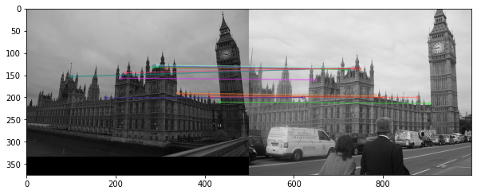
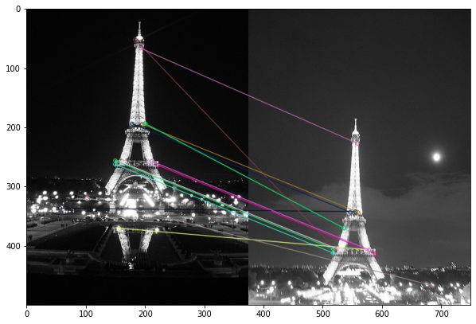
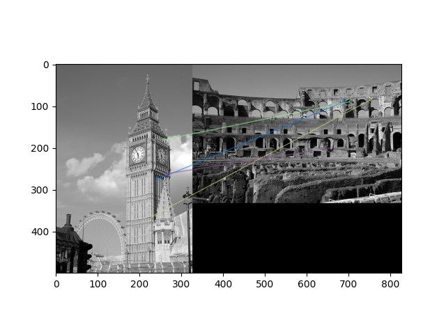
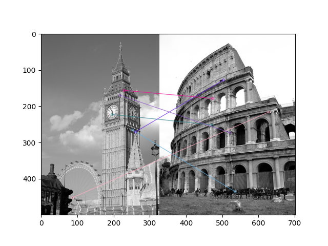
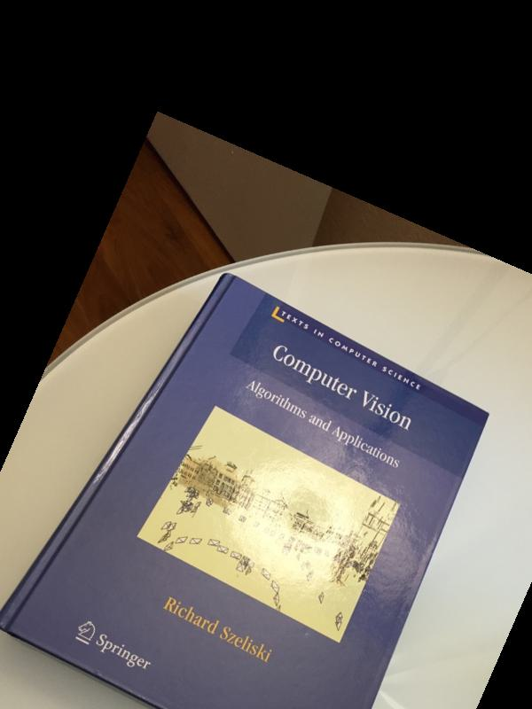
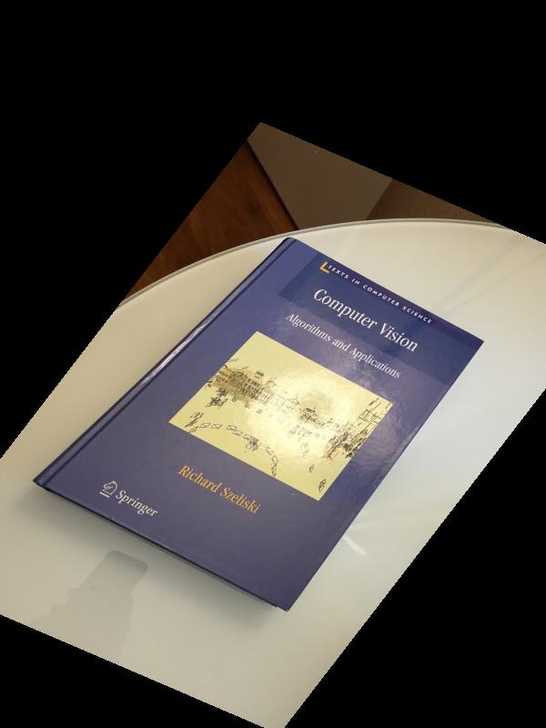
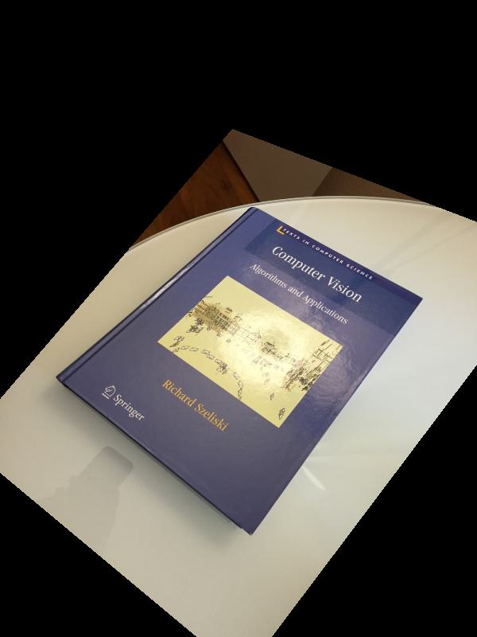
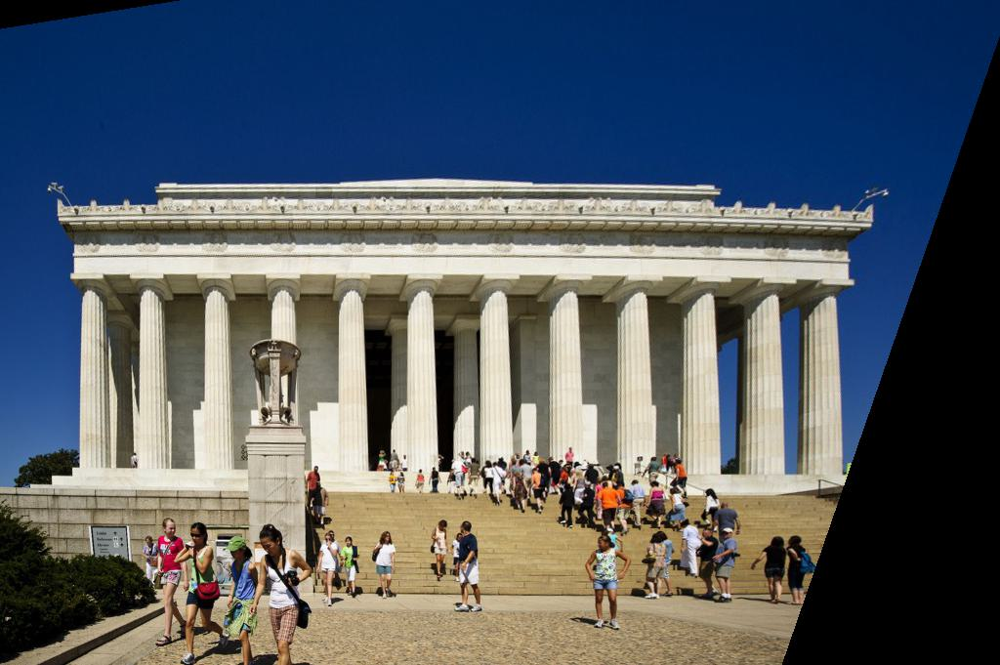

# part1.py Procedure - Madhav(makejari)
## Steps Taken:

- Calculate ORB features using openCV library, take Keypoints and Descriptors of these features
- Calculate top two similar matches using `KnnMatch()`
- Filter only significant matches using threshold value
- Generate a similarity matrix using number of matches between two images that are below the threshold 
- Apply scaling and `PCA`
- Used KMeans Clustering
- Calculate the performance of the model
- Output the result in `output.txt` file

## Experiments:

#### Feature Matching
- We first wrote matching number of features using different distance metric such as hamming distance and euclidean distance
- White the results were decent, it was too slow to compare each image with each other
- Finally, we decided to use `BFMatcher` and `KnnMatch` to calculate the top two similar matches of features

#### Clustering
- We tried various clustering algorithms but none of them gave good engouh results
- Tried Agglomerative Clustering but result was around 0.60
- Used Spectral Clustering and the results was around 0.58
- Evaluated result on Kmeans as well but that was quite worse than Agglomerative and Spectral, around 0.51
- So we decided to convert the matrix using `StandardScalar` using sklearn, Applied `PCA` using sklearn
- Then I tried Agglomerative clustering on resultant data and the result was not good, around 0.45 which is expected
- Similarly, I tried Spectral clustering and even that performend worse as expected
- Then we tried KMeans that gave us the best results, fluctuating between **0.74** and **0.81**

## Results:

We achieved the accuracy of around **0.74** and **0.81**

In terms of Feature Matching, the result were good in some images but some were very bad. Below is the example of How some results were good and some were bad,

#### CASE 1: Correct Detection

#### CASE 2: Correct Detection

#### CASE 3: Incorrect Detection

#### CASE 4: Incorrect Detection

Though the result was quite good, the accuracy could have been improved by using more complex data for clustering other than just simple distance matrix. One trend we noticed in clustering was that a lot of images were gathering in the same cluster which might be because of the image type. More exploration is required to learn more about this behavior.

# part2.py Procedure - Saumya(mehtasau)
## Steps taken:
- Find transformation matrix 
- Inverse warp
- Bilinear interpolation

# Find transformation matrix
- Create a transformation matrix based on option from command line
- Used a different procedure for finding transformation matrices based on the option from command line
- Reshape the transformation matrix into 3x3 matrix  
- Return the inverse of the transformation matrix

### Create transformation matrix

**n=1 (Translation)**
- For n=1, I used tx = x-x' and ty=y-y' directly instead of using numpy's solver.
- The resulting matrix looks like [[1,0,tx],[0,1,ty],[0,0,1]]
- This matrix calculates translation from destination to source, I return the inverse of this matrix to get mapping of points from source to destination.

**n=2 (Eucledian/ Rigid Transformation)**
- For n=2, I find the translation matrix as defined above
- I find the rotation matrix as multplication of 3 shear matrices
- The three shear matrices are
    - sh1: [[1, -np.tan(rad/2),0],[0,1,0],[0,0,1]]
    - sh2: [[1, 0,0],[np.sin(rad),1,0],[0,0,1]]
    - sh3: [[1, -np.tan(rad/2),0],[0,1,0],[0,0,1]]
- I then reshape each shear matrix to 3x3 shape which easies multiplication operation and multiply them 
- I multiply the resulting rotation matrix with translation matrix which returns a transformation matrix

**n=3 (Affine transform)**
- For n=3, I use system of linear equations to solve for transformation matrix
- The solution is a closed form solution and is obtained by H = A^-1.b 
- The final matrix is of form [[a,b,c],[d,e,f],[0,0,1]]

**n=3 (Projective transform)**
- For n=4, I use system of linear equations to solve for transformation matrix
- The solution is a closed form solution and is obtained by H = A^-1.b 
- The final matrix is of form [[a,b,c],[d,e,f],[g,h,1]]

# Inverse warp
- I multiply a homogenous point in an empty image [c,r,1] with inverse of the transfrom matrix to find an inverse projection point. The resulting point is of the form [x_,y_,w]
- I adjust the values for x_ and y_ coordinates with w.
- I then call bilinear interpolation on the the point (x_,y_) if it lies within the bounds of the original image and fill the pixel values at that location from original image

# Biliear Interpolation
- I take the inverse projected coordinates of the new image and then try to find pixel values from source image
- If the values of coodinates are within bounds of original image, it Biliear Interpolation finds values for that pixel 
from it's neighbouring pixels
- I used a weighted sum to calculate the final pixel values
- The weights are based on distance of the projected point from it's nearest pixels (nearest integer in x and nearest integer in y). For example if dx is distance of point from nearest integer x value and dy is the distance of point from nearest integer y value, a point at [x1,y1] can have a weight of (1-dx)*(1-dy) and a point [y2,x2] can have a weight of dx*dy

## Some environment setup guidelines that I followed
- I created a new conda environment for CV with it's environment.yml file.
- I included all packages necessary for my algorithms in this file and I create and update the environment based on the following commands

### Creating conda env
-  conda env create --file=environment.yml

### Update conda env
- conda env update --name="name of env" --file=environment.yml

# Assumptions
- I assume that the input format for part 2 would be: part2 n destination_image_path source_image_path output_image_path coordinates of destination image coordinates of source image ... coordinates of destination image coordinates of source image

# Some results from book images

## inputs 

### source image

### destination image

## outputs 

### n=1 -> Translation

### n=2 -> Euclidean

### n=3 -> Affine

### n=4 -> Projective

# Results on the lincon image 

### source image

### output

# Sample commands
- We have added sample commands in commands.txt which might be helpful to run the code as a source file
- Prior to running the source file, we make the file executable using chmod +x a2

# part3.py

## steps taken:
- Taken points using orb.
- Applied ransac to remove outliers and got the best homograpyh matrix.
- Transformed the image using homography matrix.
- Combined the First image and transformed image.

## RANSAC Method
- We have two images as input, image1 and image2. We are transforming image2 in perspective of image1.
- ORB points of source image and destination image is taken as an input to compute ransac. At first, number of iteration is selected as 200 which gives acceptable answer. Four random pair of samples are taken from the feature points of image1 and image2. And homography matrix is calculated to transform those four points selected from image2 to perspective of image1. So we will get value of H, where H is homography matrix (image1 <- H <- image2). 
- After getting H, every point of the image2 is taken and transformed using H. Transformed point and it's pair in image1(which we got using ORB) are compared. If transformed point is in certain threshold, that point is acceptable. We will increase our count of acceptable points.

- Selecting four random point, get transformation matrix, compare every value and store maximum acceptable points and its transformation matrix.
- After repeting above steps n times(200 in our case), we will get best possible transformation matrix which is acceptable by maximum number of points.

## Transformation after RANSAC.
- After applying RANSAC, now we have transformation matrix and feature points without outliers.
- First of all, we need empty matrix which will hold our transformed image2. For that we will take four corner points and transform them using our transformation. By this, we will get where the image2 points will fall on image1 after applying transformation. Again, we are transforming image2 into prespective of image1. Using those four corner points we calculated maximum length requied for transformed image2. Same way we will calculate the dimension of our final image which is image1 + image2(transformed).
- Now we will transform our image2 using transformation matrix H. We will store that image2(transformed into perspective of image1) in top right corner of our final image. And save the image1 on the bottom left of that same final image which will result in our final panaroma.

## Assumptions
- We assumed that the image is stiched on right top of the image. In our case, image2 is stiched on right top of image1.

## Results
- Some results are stored in "Stiched_images_example" folder. Using simple images results in acceptable panarom image.

##  Problems
- After getting transformation matrix, while applying RANSAC, we need to calculate it's inverse. Some transformation matrix are singular matrix and no inverse is possible for those matrix which resulted in failure of our code. Four points are selected randomly so if any singular matrix is found, code was failing. It was happening totally random and surprisingly frequent. Fixed it using 'Try Except'.
## Observation 
- While testing on some images, we observed that, image stitching, running our code, requires images (image1 and image2) to be overlapped significantly. Else code might not find proper ORB points and transformation will fail.

# Contribution of Authors
The report for the individual part of the code were implemented the authors of the code.

For part 1 of the assignment, different feature matching and clustering techniques were analyzed by Madhav(makeajari)
The report for part 1 was done by Madhav

For part 2 of the assignment, different methods for finding transformation matrix were explored by Saumya(mehtasau).
The report for part 2 was done by Saumya

For part3 of the assignment, RANSAC was implemented and image warping method was tweaked to get image boundaries for the image that needs to be stiched to the source image. This was achieved by first finding the bounding box (new height and width)
of the resulting image and then proceeding to place the previous image and then stiching the other image. Part3 was implemented by Krutik(kaoza). The report for part3 was done by krutik

